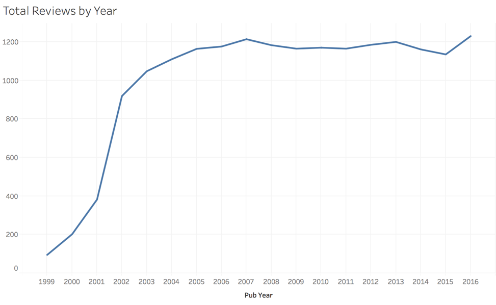
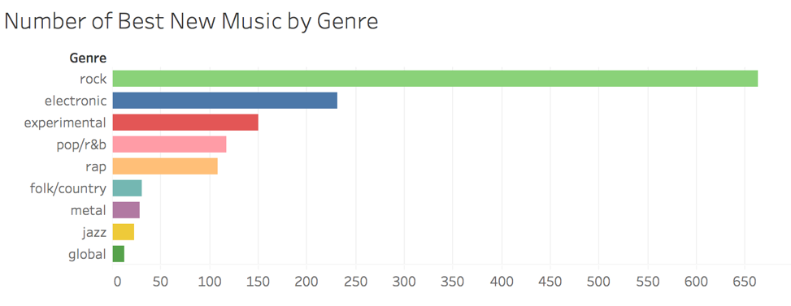
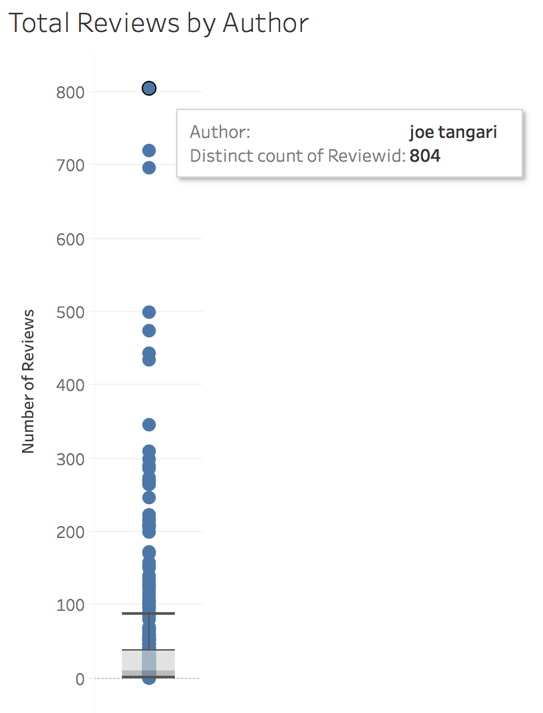
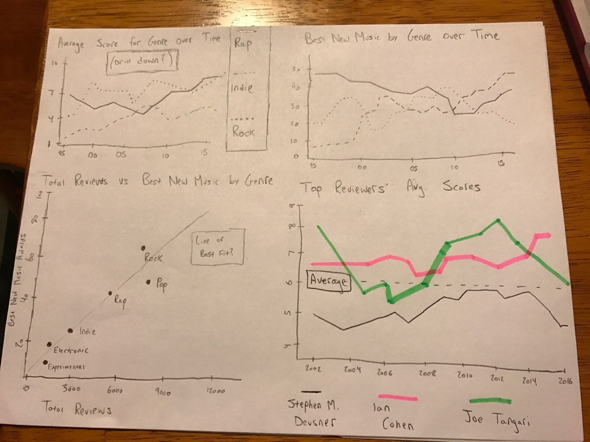
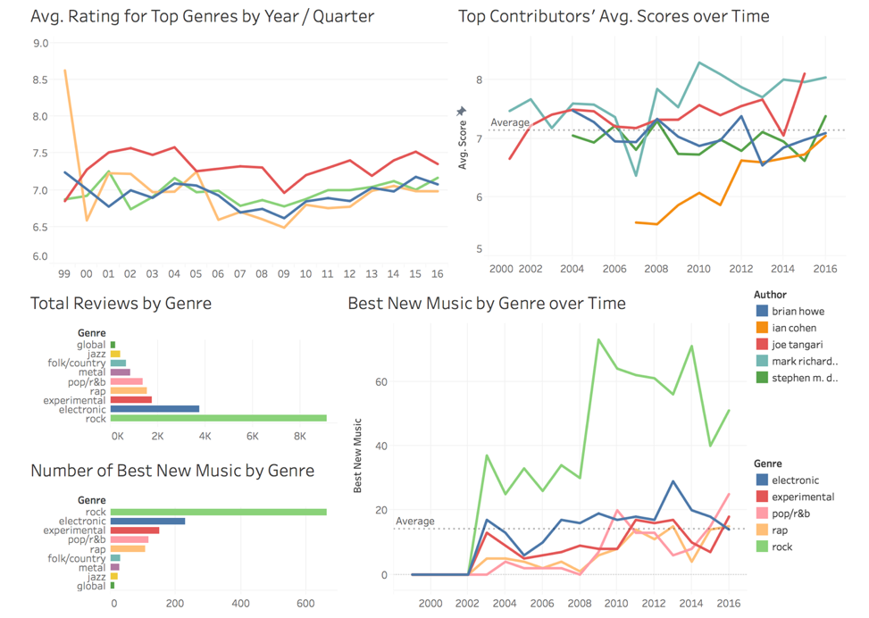
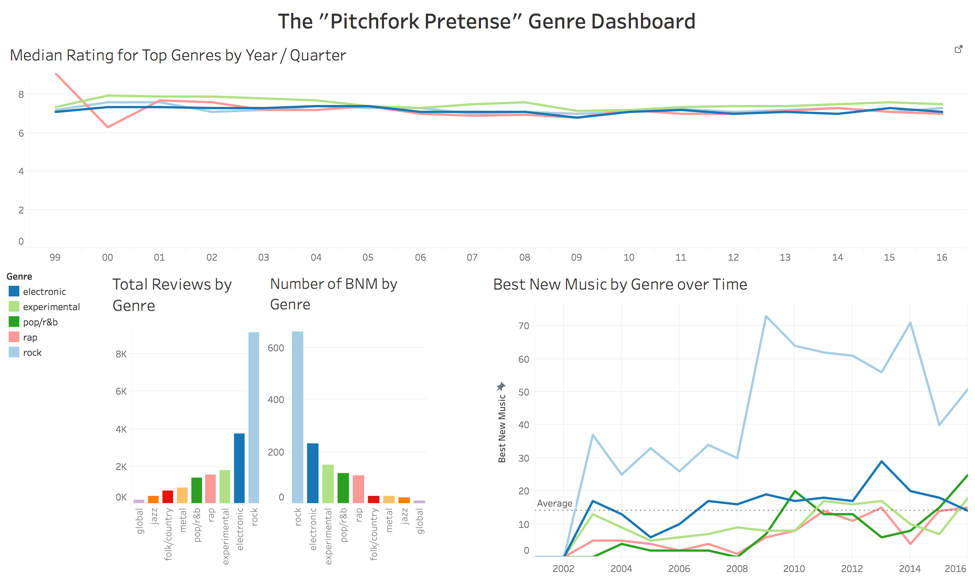
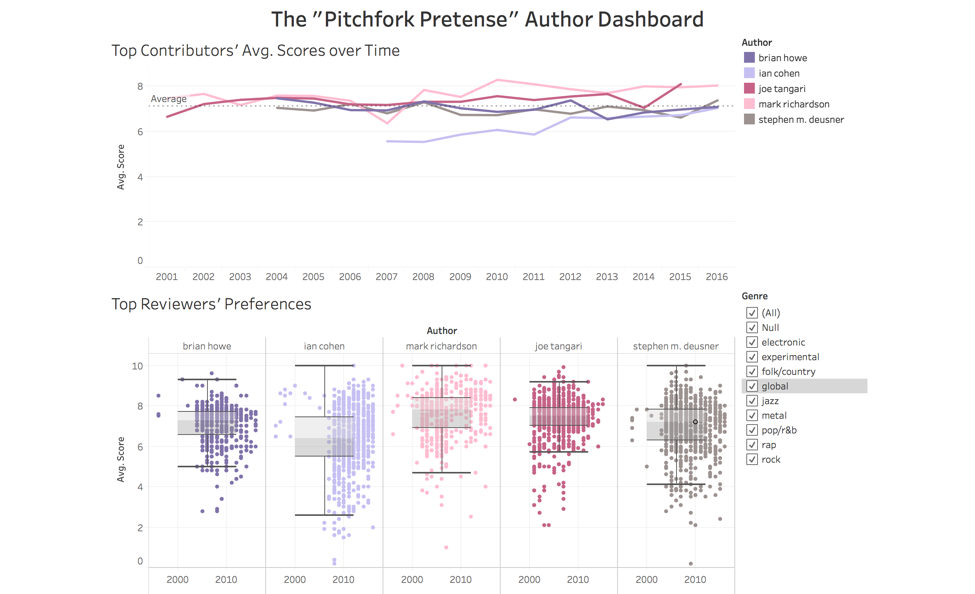

# Welcome to the Pitchfork Pretense

## About the Pitchfork Pretense Project
Pitchfork is an online hub for all things music. Started in 1996 by Ryan Schreiber, the website primarily focused on indie music and smaller artists. As the site grew in popularity (eventually being acquired by the media company Condé Nast), they began to expand their coverage to all types of music. The website grew a reputation for some of the most credible and insightful reviews of contemporary music. Each month, the website generates traffic from over 1.5 million unique visitors. It is arguably the most popular independent music publication online today.

Being one of the most popular critics of music, Pitchfork has strong influence over how the industry perceives different artists and albums. As they have grown in popularity though, many fans of the publication believe that their reviews have become less critical and less thought-out. Loyal fans of the site have started to look to other review sources as a result.

## Purpose of “The Pitchfork Pretense Project”

With the two creators of this project having a vested interest in music, Pitchfork has always been one of our favorite sites. We have noticed readers of the website criticizing it more; there is a common stigma that it has “changed” for the worse over the past 20 years since its founding. The “Pitchfork Pretense Project” wants to visualize whether or not there have been drastic changes to the site over time. Our goal is to determine whether or not the recent criticism of the site has been based on false pretenses (thus the name of the project), or if the criticism is valid. 

## Related Work 

We were able to derive inspiration from some of the “kernels” posted on the Kaggle page where we retrieved our data. We looked at the ways where authors of these kernels conveyed the data; one example used primarily histograms and box-and-whisker plots, whereas others used a number of creative tables and dot-plots to achieve proper exploration of the data.

## Research Questions 

1. How have Pitchfork review scores changed over time? Has the evolution been different for different genres of music?

This was really the over arching question that we were trying to tackle. What is the overarching secret to the success behind these services? Is it possible to use this same type of technology for other services? 

2. How consistent have individual reviewers been with their scores over time? [Primarily looking at the top contributors to the website; the authors that have written the most reviews]

The individuals who contribute the most to the publication are most likely to set the culture for the rest of the site, and likely have the most influence on the way the average reviewer perceives the website.

3. Has Pitchfork been more willing to give out “Best New Music” designations in recent years? How has this evolved for different genres? 

“Best New Music” is a separate page of the website that essentially summarizes the most essential recent releases that readers should look into. Changes in criteria for this award could account for the recent change in perception for the site. 

## Data

Data was centralized in multiple tables in the data set. They are listed below. All records are identified by a “ReviewID” primary key.

### Reviews:	
Contain information on the album being reviewed (title of the album and the artist that made the album) as well as the review itself (the score given from 0.0 – 10.0, the author, whether or not it was given “best new music,” and the date the review was published).

### Artists:	
Contains only a single attribute: artist. Helpful when more than one artist contributed to an album. Allows multiple artists to be listed for a single album.

### Content:	
Contains only a single attribute: content. Direct copy of the body text from the review itself; will be used for word clouds.

### Genres:	
Contains only a single attribute: genre.

### Labels:		
Contains only a single attribute: label. Lists the record label for the album.

### Years:		
Contains only a single attribute: year. This refers to the year of the album’s release. This is important to distinguish, because oftentimes Pitchfork will review albums that have been rereleased or re-mastered. This allows the website to reflect on bodies of work that were very influential.

## Exploratory Data Analysis 

We used Tableau to do our EDA, as we are more comfortable with this software than R. We first imported the Reviews table to Tableau, as it is the primary source of data in the database. As we added the other tables, we used Left Joins so that we could aggregate information about the number of Reviews (even if there is missing data in other tables). We planned on filtering out null data when needed in our visualizations.

We filtered out all data for albums that were released before 1996 (the year in which Pitchfork was founded). When “classic” albums get rereleased, Pitchfork will often give these albums high scores. We excluded these reviews to prevent our data from being skewed. We also filtered out all data for albums reviewed in 2017, as this dataset only records albums reviewed in January of that year. 

We made histograms and box-and-whisker plots to summarize key points in the data (i.e. how many reviews were published per year?)

When looking at the data in tabular format, we found that there were very few null records and that the data must have been cleaned by the user that posted it on Kaggle. As such, we were able to begin our analysis of the data fairly quickly.

EDA on how the publication has grown, (based on the amount of reviews conducted each year)

EDA on BNM awarded to different genres

EDA on the most frequent contributors to the publication (based on # of reviews written)

Design Evolution 

After reviewing our research questions, we began to sketch graphs and plots that might provide answers to our questions. Since there was a time component to most of our questions, we found that line graphs would likely have to be a popular choice in our dashboard.

We also considered different opportunities for interactivity. By creating a hierarchy in the date information, we could allow the user to drill down on some of our line graphs and derive additional insights on the data. Additionally, since Genre is a popular “mark” to use in our sheets, we could include a universal filter that would allow the user to see how a single Genre appears in multiple graphs on the dashboard.

## Design Corrections

After reviewing the first round of designs there were many things that needed to be adjusted to allow our insights to be more readily available. We had many corrections to make, from simple color scheme design to more pressing insights that we felt we had missed the first time.

Above is the original dashboard that we had submitted for review. One of the very first issues we had to account for was the color scheme that we had chosen to use. If you notice, the graphs themselves look very uniform and similar when presented on a dashboard, however this posed a problem for our viewers. There is no difference between the colors we used for the authors of the reviews and the genres that chose to review. To combat this problem, we decided to replace our current color schemes with two different color schemes that were also considered color blind safe. This now helped users distinguish more clearly what it was that they were looking at. (Adjustments will be shown in the Implementation section)

There were also certain insights that we had discovered but were unsure of how to communicate them more clearly. The main insight we felt we wanted to communicate was how individual albums and genres were being rated by individual authors. To combat this issue, we decided to create a new dot chart that would highlight the individual albums and where they fell and we were also able to filter the data by genre. The graph will be displayed in the Implementation section of the process book.

## Implementation

We mocked up a plot for the “Total Reviews vs. Best New Music by Genre” sheet (as it appeared on the sketch of our dashboard). Unfortunately, we felt it was not as readable as an alternative medium. We tried many different color schemes and options, but we struggled to improve the readability of the graph. After showing this plot to some of our housemates, they were unable to derive many insights from it. As such, we decided to go with two adjacent bar charts in the final draft of our dashboard.

In order to limit the amount of data on our dashboard, we limited some of our analysis for top genres and top authors. We filtered the data to include only the Top 4 genres (by number of reviews for each one), and the Top 5 authors (also by number of reviews written). This allowed us to reduce clutter on the graphs, and gave us a large sample size for analysis.

## Final Draft of our Dashboards

As you can see, from the original dashboard, we decided to break up our singular dashboard into two dashboards where insights about the genres and authors could be examined more clearly. The line graphs are now completely separated with different colors which allows us to quickly identify what it is that we are looking it. We also decided to use the median rating on the genre dashboard as opposed to the average to give us a better understanding of the data. The addition of the dot plot on the author dashboard, previously mentioned, gave us a more granular insight into how each album and genre fell into the author categories. This allowed us to examine the insight of how different genres and albums varied between the authors. Additionally, we included elements for the user to interact with so that they can explore the data on their own. We found this to be one of the most enticing parts of the dashboard.

We feel that this final dashboard is an extremely well put together, by separating into our insights into two separate dashboards we allow the Pitchfork folks to gain insights that will help the viewers of their websites. Going forward we would like to take this data and implement them for other clients, driving people to your website isn’t the only challenge anymore, keeping people there is equally as important and the insights provided will help give the consumers what they need. 

## Analysis of the Dashboards

Copied image of our dashboards for easy reference

Median ratings given out by the publication have stayed fairly consistent over time. One would assume that Pitchfork preferred 90’s rap due to the spike in review scores given in 1999. However, they only reviewed 4 albums in 1999 so this is not a significant outlier in the data. Even though Pitchfork prides itself on being a very critical review site, their average score is around a 7; this skews higher than expected. The publication has the greatest preference for Experimental music, as it scores consistently higher than all other genres (albeit by a small margin).

When examining the Top Reviewers’ Preferences dot charts, we can see that some authors not only have softened up in recent years, but also have been conducting fewer reviews. This change in quantity of reviews can more than likely be accredited to advancement in the organization. The largest example of this insight is Joe Tangari, as we can see, from 2000 to about 2007, Joe was preforming many more reviews and have scores that dipped well below his first quartile range. In later years, he did fewer and his scores increased. On the contrary we also see some authors have a decrease in ratings, such as Ian Cohen who started off rating albums higher and progressively became more critical.   

The scores that Top Contributors give out are more subject to change. This is likely because an individual can change more easily than an entire publication (comprised of hundreds of reviewers) can. This is most evident in Ian Cohen and Mark Richardson. Cohen is notoriously one of the harshest critics on the site, and has an average score of 5.5 back in 2007-08. As time goes on, he became less critical and his average review score has begun to climb up and be more similar to his peers’ scores. Richardson, on the other hand, is one of the more positive reviewers that the site has. In 2007 though, his average score dropped by an entire point and became the second lowest of the reviewers listed. The next year, it climbed back up rapidly to be relatively positive.

Copied image of our dashboards for easy reference

Rock is overwhelmingly the most popular genre for Pitchfork to review; it is over twice as popular as Electronic music, and is over four times as popular as all other genres. As such, it has a proportional level of dominance in terms of the “Best New Music” awards it receives. In fact, “Best New Music” awards given to each genre are exactly proportional to the number of reviews each genre receives. The only exception is Pop/R&B: Rap music for the BNM award, even though Rap has a higher number of reviews granted.

When we look at how the “Best New Music” award has been granted to genres over time, we see that the award was first introduced in 2003. Ever since its introduction, Rock music has been dominant over other genres in receiving this award. In 2009, Rock music exploded in popularity for receiving this award. All other genres have stayed fairly constant, although Electronic music had a marginal bump in 2013 as well. Rock music has since become less awarded in the past two years, as other genres like Rap, Pop/R&B, and Experimental have climbed upwards.

Overall, many of the criticisms that loyal fans of Pitchfork have made in recent years seem to be rooted in pretense, as we hypothesized. The publication has been fairly consistent in the twenty years since they were founded. It is our best guess that the criticism that the publication faces is due to its rapid growth in popularity; fans who have followed Pitchfork since its early days probably felt a more intimate connection to it when it was smaller and more niche. There is likely a stigma against it now that they are larger, even though they push out relatively the same quality of critique.

